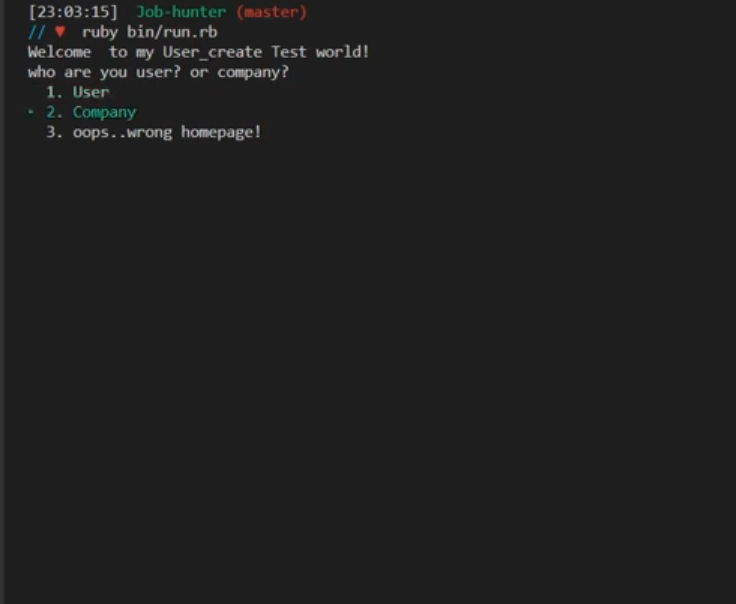

Job Hunter

# Job Searching App

### User view
---

### Company view
---

## Technologies Used

-Ruby

# Known Bugs

- Editing users: user can able edit email  but not name or contact.
- Editing company: similar to user, company can only edit program language.

# Improvements

- Too many class method. Refactor with less class method would be nice(for better view and understanding the codes)
- Seeding datas(Some datas can loop with  using  methods not hardcoding)
--------------------------------------------------------------------------------

# User Stories

- Job search(very lite version)

## User can..

As a user, I can ...
- User can signUp/logIn
- User can search various companies from the list.
- User can apply to a company and view all the applied company from his/her applied list.
- User able to delete one of the company from his/her list.
- User able to edit his/her profile. 

As a company, company can..
- Company can signUp/logIn
- Company can view applied candidates 
- Comapny can remove an applied candidate from its list.
- Comapany can edit it's profile.